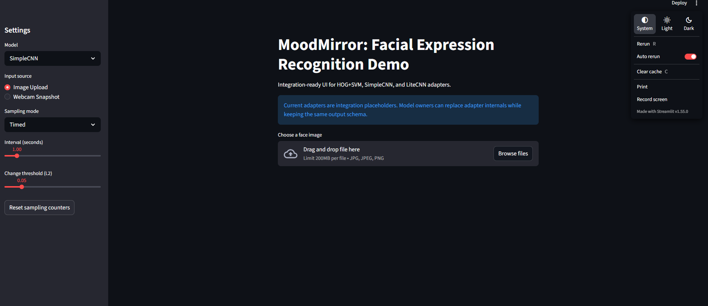

# EE4016 MoodMirror

This repository contains the code and documentation for the EE4016 Group 10 project:
MoodMirror - Lightweight Facial Expression Recognition with Convolutional Neural Networks.

## Project Overview
MoodMirror is a lightweight facial expression recognition (FER) system that classifies seven emotions:
angry, disgust, fear, happy, sad, surprise, and neutral.

The project includes:
- Baseline models (HOG+SVM and SimpleCNN)
- Proposed LiteCNN architecture
- CLCM replication path
- Ablation-focused experimentation
- Interactive web demo (image upload, webcam snapshot, and live video mode)

See EE4016_Project_Proposal.md for the full methodology and target objectives.

## Repository Workflow
1. Clone the repository:
   ```bash
   git clone https://github.com/muya17/EE4016_MoodMirror.git
   cd EE4016_MoodMirror
   ```
2. Create your own working branch:
   ```bash
   git checkout -b <your-branch-name>
   ```
3. Push your branch:
   ```bash
   git push --set-upstream origin <your-branch-name>
   ```
4. Commit and push your work:
   ```bash
   git add .
   git commit -m "Describe your changes"
   git push
   ```
5. Open a Pull Request to merge into the target branch.

## Dataset
FER2013 is used for training and evaluation.

- Kaggle dataset page: https://www.kaggle.com/datasets/msambare/fer2013
- If you only run the demo app with existing model artifacts, dataset download is not required.
- If you train or evaluate models, place FER2013 in folder format under:
  - data/fer2013/train/<emotion>
  - data/fer2013/test/<emotion>

## Run Demo App
Recommended one-command launch from project root:

```bash
bash run_app.sh
```

Manual equivalent:

```bash
if [ ! -d .venv ]; then python3 -m venv .venv; fi
source .venv/bin/activate
python -m pip install --upgrade pip
python -m pip install -r requirements.txt
python -m streamlit run demo_app.py --server.headless true --server.port 8502
```

Live video mode requires browser camera permission and uses streamlit-webrtc.

## Models Used by the App
The app supports the following artifacts in saved_models:
- hog_svm_artifact.pkl
- SimpleCNN_best.pth
- LiteCNN_best.pth
- clcm_best_weights.pth

If any checkpoint/artifact is missing, the app still runs with fallback adapters.

## Important Notes for Presentation Branch
- Presentation branch is intended to be runnable for demo purposes after clone.
- Model artifacts are included for app inference paths.
- Large dataset files are intentionally not tracked in git.

## Demo Preview

