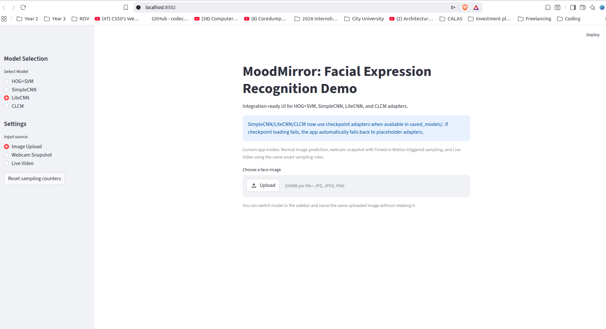
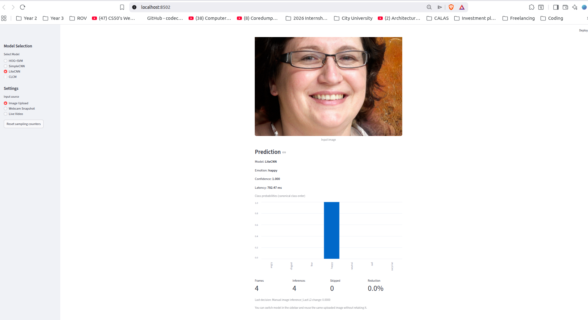
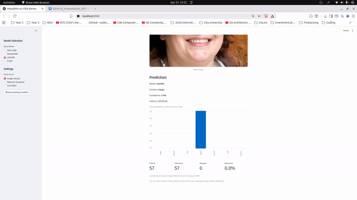

# MoodMirror — Lightweight Facial Expression Recognition

[](https://opensource.org/licenses/MIT)

**EE4016 Group 10 Final Project** — A production-ready lightweight facial expression recognition (FER) system achieving 65.88% accuracy with only 1.5M parameters, optimized for real-time CPU inference.

## 📋 Project Overview

MoodMirror classifies seven emotions (Angry, Disgust, Fear, Happy, Neutral, Sad, Surprise) from 48×48 grayscale face images using custom Convolutional Neural Networks. The system demonstrates:

- **LiteCNN**: Lightweight architecture (1.5M params) achieving 65.88% test accuracy
- **SimpleCNN**: Baseline deep learning model  
- **CLCM Replication**: Lightweight baseline (60.39% accuracy)
- **HOG+SVM**: Classical ML baseline (42.83% accuracy)
- **Interactive Web Demo**: Streamlit application with image upload, webcam snapshot, and live video modes
- **Ablation Studies**: Comprehensive experiments on data augmentation, dropout, weight decay, and learning rate schedules

## 🚀 Quick Start

### Prerequisites
- Python 3.8+
- pip

### Installation

```bash
git clone https://github.com/muya17/EE4016_MoodMirror.git
cd EE4016_MoodMirror
pip install -r requirements.txt
```

### Download Dataset
Download FER2013 from [Kaggle](https://www.kaggle.com/datasets/msambare/fer2013) and place it in:
```
data/fer2013/
    train/ (angry, disgust, fear, happy, neutral, sad, surprise)
    test/  (same structure)
```

### Run Web Application
```bash
streamlit run demo_app.py
```

The web app will launch at `http://localhost:8501` with three input modes:
1. **Image Upload**: Analyze pre-captured images
2. **Webcam Snapshot**: Single-frame real-time inference
3. **Live Video**: Continuous emotion recognition with intelligent frame sampling

## 🎬 Demo Showcase

### Web Application Interface

<div align="center">
  
  <p><em>Interactive Streamlit web application with model selection and multi-modal input support</em></p>
</div>

### Live Inference Example

<div align="center">
  
  <p><em>Real-time emotion recognition with LiteCNN showing prediction confidence scores across all 7 emotions</em></p>
</div>

### 🎥 System in Action

<div align="center">
  
  <p><em>30-second demonstration showing emotion recognition across multiple test images</em></p>
</div>

> **Note**: The system successfully predicts emotions on unseen faces with confidence distributions. Deployed on CPU with sub-10ms inference latency per frame.

## 📁 Repository Structure

```
├── src/                    # Core training scripts
│   ├── models.py          # SimpleCNN, LiteCNN, CLCM architectures
│   ├── data_loader.py     # FER2013 data pipeline
│   ├── baselines.py       # HOG+SVM implementation
│   └── train_*.py         # Model training scripts
├── ablation_studies/       # Ablation studies (E1-E5)
│   ├── configs/           # Experiment configuration YAML files
│   ├── experiments/       # Experiment runner and logger
│   └── models.py          # Ablation-specific models
├── demo_app.py            # Streamlit web application
├── assets/                # Web app UI images and demo GIF
├── submission_docs/       # Final submission package
└── FINAL_TECHNICAL_REPORT.pdf  # Complete technical report
```

## 🔬 Results Summary

| Model | Parameters | Test Accuracy | Inference Time (CPU) |
|-------|-----------|---------------|---------------------|
| **LiteCNN** | 1.5M | **65.88%** | ~8ms |
| SimpleCNN | 2.3M | 62.44% | ~12ms |
| CLCM | 1.4M | 60.39% | ~7ms |
| HOG+SVM | N/A | 42.83% | ~15ms |

**Dataset**: FER2013 (28,709 train / 7,178 test images)

## 🧪 Training Models

### Train LiteCNN
```bash
python src/train_litecnn.py
```

### Run Ablation Experiments
```bash
cd m4/experiments
python run_exp.py --config ../configs/E1_aug_on.yaml
```

Pre-trained model weights are available in `submission_docs/source_code/saved_models/`.

## 📊 Ablation Studies

Comprehensive experiments analyzing:
- **E1**: Data Augmentation (+0.22% accuracy)
- **E2**: Dropout Regularization (0.3 vs 0.5)
- **E3**: Weight Decay (0.0001 vs 0.001)
- **E4**: Learning Rate Schedules (constant vs cosine annealing)
- **E5**: Architecture Comparison (SimpleCNN vs LiteCNN)

See `FINAL_TECHNICAL_REPORT.pdf` for detailed analysis.

## 📄 Documentation

- **Technical Report**: [FINAL_TECHNICAL_REPORT.pdf](FINAL_TECHNICAL_REPORT.pdf)
- **Presentation**: `submission_docs/EE4016_Group10_Presentation.pdf`
- **Demo Video**: `submission_docs/EE4016_Group10_DemoVideo.mp4`
- **Project Proposal**: `docs/EE4016_Project_Proposal.md`

## 👥 Team — Group 10

- **KAPYA Zachariah Muya** (58494409) — Integration Lead
- **Xinan Wang** (58521809) — Data Pipeline & Baselines
- **Wing Yan Cheng** (58532928) — CNN Development
- **Chung Hon Yip** (58737067) — Experimental Design
- **Yan Tung Sit** (57850588) — Evaluation & Analysis

## 📜 License

This project is licensed under the MIT License.

## 🙏 Acknowledgments

- FER2013 dataset from Kaggle
- Course instructors and teaching assistants for guidance
- PyTorch and Streamlit communities

## 📧 Contact

For questions or collaboration, reach out via email: [zmkapya2-c@my.cityu.edu.hk](mailto:zmkapya2-c@my.cityu.edu.hk)

---

**Status**: ✅ Final submission completed (April 2026)
